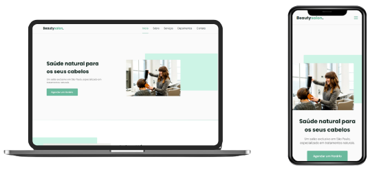

<h1 align="center"> ✂️ BeautySalon. </h1>

<h2 align="center"> 📝 Descrição </h2>

<p align="center">Projeto de um suposto salão de cabeleireiro feito na trilha origin durante a NLW 6.</p>
<hr>


<h4 align="center"> 
	Status: ✅ CONCLUÍDO ✅
</h4>
<hr>
<h2 align="center" id="design">
  🎨 Design
</h2>
<h2 align="center">
  </h2>
  <h3 align="center"><a href="https://www.figma.com/file/YJ21RnZoelU6tthwExzMVP/Origin-Six/duplicate" target="_blank">Link no Figma</a><br>
  <a href="https://igorvini25.github.io/Beautysalon-NLW6" target="_blank">Site do Projeto</a></h3><hr>
  <h2 align="center">A Paleta de cores</h2>
  <h3 align="">A Paleta de cores do projeto foi feita de uma forma que fique fácil de trocar as cores.</h3><br>
  <h3 align="center">Indo na linha <b>26/27</b> no arquivo style.css você encontrará isso:</h3>
  
  ```css
  26 /* Cores Recomendadas: 159, 36, 270, 345 */
  27 --hue: 159;
  ```
  <h3>Você pode trocar a variável <b>"--hue"</b> Para qualquer valor entre 0 e 359, mas deixei as cores recomendadas na linha 26 </h3><hr>


<hr>
<h3 id="tecnologias" align="center"> ⚒️ Tecnologias e API's </h3>
As seguintes tecnologias foram usadas na construção do projeto:
- HTML 5
- CSS 3
- Javascript
As Seguintes API's foram utilizados no projeto:
- <a href="https://scrollrevealjs.org/" target="_blank">ScrollReveal</a>
- <a href="https://swiperjs.com/" target="_blank">Swiper</a>
---
</p>
